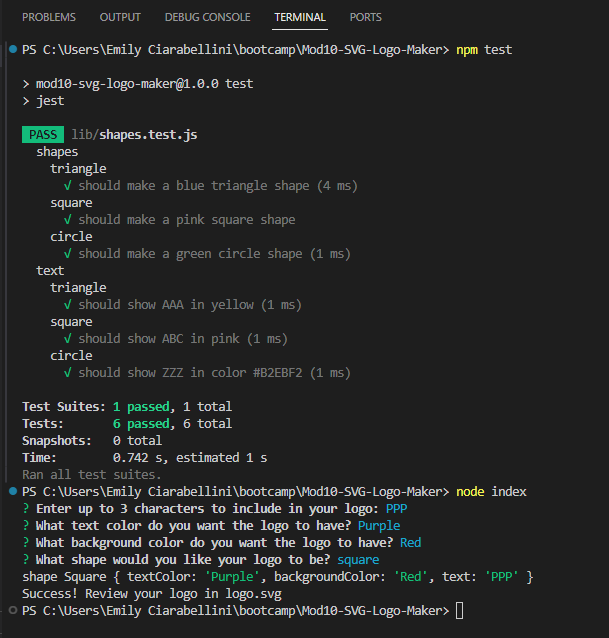

# Mod10-SVG-Logo-Maker

## Description
This project is a Node.js command-line application that takes user input to generate a logo and save it as an SVG file. This uses Jest for testing and Inquirer for collecting input from the user. 

## Table of Contents
- [Installation](#installation)
- [Usage](#usage)
- [Credits](#credits)
- [License](#license)
- [Questions](#questions)

## Installation
Clone the repository from Github, then run npm install in the terminal to install node npm packages. To run the program, type  node  index.js. To test, type npm tests.
- [Repository on GitHub](https://github.com/eciarabellini/Mod10-SVG-Logo-Maker)

## Usage
- [walkthrough video](https://drive.google.com/file/d/1t1xJizuWwNDJqYZSX9ngkrXpIZ0Yw6lD/view)
- 

## Credits
n/a

## License
MIT

## Questions
[GitHub Profile](https://github.com/eciarabellini)